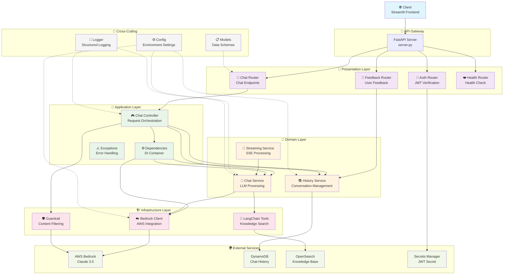
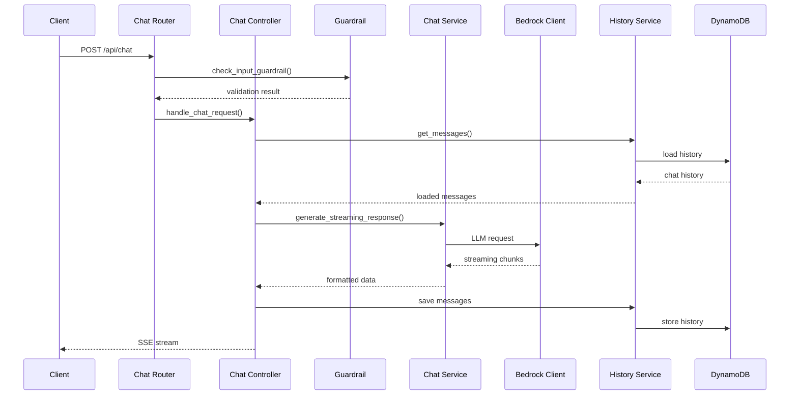

# GenAI Chatbot Application Architecture

## 📁 디렉토리 구조
```
src/
├── adapters/           # 외부 인터페이스 어댑터
│   └── chat_controller.py
├── infrastructure/     # 외부 시스템 연동
│   ├── __init__.py
│   └── bedrock_client.py
├── middleware/         # 횡단 관심사
│   ├── __init__.py
│   └── guardrail.py
├── routers/           # API 엔드포인트
│   ├── __init__.py
│   ├── auth_router.py
│   ├── chat_router.py
│   ├── feedback_router.py
│   └── health_router.py
├── services/          # 비즈니스 로직
│   ├── chat_service.py
│   ├── history_service.py
│   └── streaming_service.py
├── tools/             # LangChain 도구
│   └── retrieve_knowledge_search.py
├── utils/             # 공통 유틸리티
│   ├── logger.py
│   ├── models.py
│   └── performance_logger.py
├── dependencies.py    # 의존성 주입
├── exceptions.py      # 예외 처리
├── config.py         # 환경 설정
├── constant.py       # 상수 정의
└── server.py         # 앱 진입점
```

## 🏗️ 아키텍처 레이어

### **1. Presentation Layer (프레젠테이션)**
- **routers/**: FastAPI 라우터들
  - `auth_router.py` - JWT 인증
  - `chat_router.py` - 채팅 API
  - `feedback_router.py` - 피드백 수집
  - `health_router.py` - 헬스체크
- **server.py**: FastAPI 앱 설정 및 라우터 등록

### **2. Application Layer (애플리케이션)**
- **adapters/chat_controller.py**: 채팅 요청 처리 오케스트레이션
- **dependencies.py**: 의존성 주입 팩토리
- **exceptions.py**: 표준화된 예외 처리

### **3. Domain Layer (도메인)**
- **services/**: 핵심 비즈니스 로직
  - `chat_service.py` - LLM 채팅 처리
  - `history_service.py` - 대화 히스토리 관리
  - `streaming_service.py` - SSE 스트리밍 처리

### **4. Infrastructure Layer (인프라)**
- **infrastructure/bedrock_client.py**: AWS Bedrock 클라이언트 관리
- **middleware/guardrail.py**: 콘텐츠 필터링
- **tools/**: LangChain 도구 통합

### **5. Cross-Cutting Concerns (횡단 관심사)**
- **utils/**: 로깅, 모델, 성능 측정
- **config.py**: 환경 설정 관리
- **constant.py**: 상수 정의

## 🔄 데이터 플로우

```
Client Request → Router → Controller → Service → Infrastructure
                   ↓         ↓          ↓           ↓
               Validation  Business   Domain    External APIs
                          Logic      Logic     (Bedrock, DynamoDB)
```

## 🎯 핵심 패턴

### **의존성 주입**
- 팩토리 패턴으로 서비스 생성 표준화
- `@lru_cache()`로 싱글톤 관리

### **레이어 분리**
- ChatService: 순수 데이터 생성
- StreamingService: SSE 형식 변환
- Controller: 오케스트레이션

### **에러 처리**
- 구조화된 예외 (`error_type`, `message`)
- 세분화된 에러 타입별 처리

## 📊 Architecture Diagram



## 🔄 Request Flow Diagram



## 📊 Layer Responsibilities

| Layer | Components | Responsibilities |
|-------|------------|------------------|
| **Presentation** | Routers | API 엔드포인트, 요청 검증, 응답 형식화 |
| **Application** | Controller, DI | 비즈니스 플로우 오케스트레이션, 의존성 관리 |
| **Domain** | Services | 핵심 비즈니스 로직, 도메인 규칙 |
| **Infrastructure** | Clients, Tools | 외부 시스템 연동, 기술적 구현 |

## 🎯 Key Design Patterns

### **1. Dependency Injection Pattern**
```python
# dependencies.py
@lru_cache()
def get_bedrock_clients():
    return get_all_bedrock_clients()

def create_chat_service(model_id: str = None, group: str = "common"):
    return ChatService(model=model_id or config.model_id, ...)
```

### **2. Streaming Architecture Pattern**
```python
# ChatService: 순수 데이터 생성
async def generate_streaming_response() -> AsyncGenerator[Dict[str, Any], None]:
    yield {'role': 'assistant', 'content': content}

# Controller: SSE 형식 변환
async def stream_generator():
    async for item in chat_service.generate_streaming_response():
        if isinstance(item, dict):
            yield f"data: {json.dumps(item)}\\n\\n"
```

### **3. Error Handling Pattern**
```python
# exceptions.py
def create_http_exception(status_code: int, detail: str, error_type: str):
    return HTTPException(status_code=status_code, detail={
        "error_type": error_type,
        "message": detail
    })
```

## 🚀 Benefits

- **🔧 Maintainability**: 명확한 책임 분리로 유지보수 용이
- **🧪 Testability**: 의존성 주입으로 단위 테스트 가능
- **📈 Scalability**: 레이어별 독립적 확장 가능
- **🔄 Flexibility**: 인터페이스 기반 구현체 교체 용이
- **⚡ Performance**: 스트리밍 아키텍처로 실시간 응답

## 🔮 Future Enhancements

- [ ] **Middleware Pipeline**: 요청/응답 처리 파이프라인 확장
- [ ] **Caching Layer**: Redis 기반 캐싱 레이어 추가
- [ ] **Event Sourcing**: 도메인 이벤트 기반 아키텍처 도입
- [ ] **Circuit Breaker**: 외부 서비스 장애 대응 패턴 적용