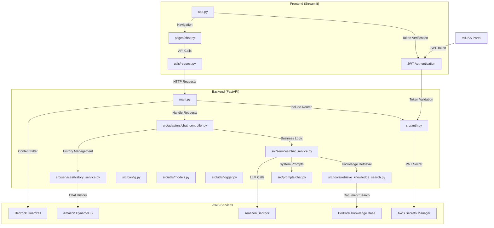
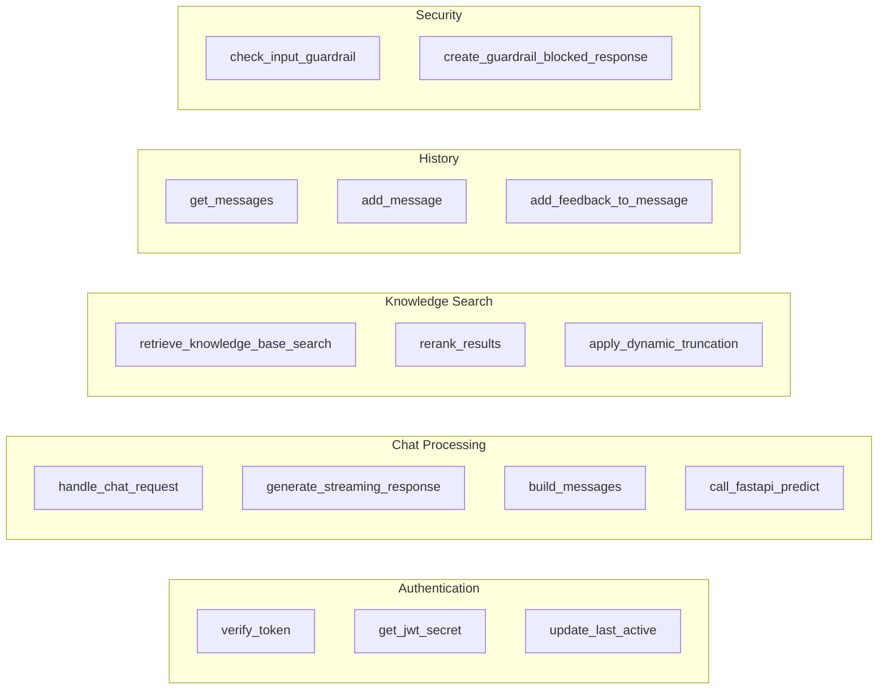

# GenAI Chatbot Platform - Application Architecture

## 🏗️ 전체 시스템 구성도

## 🔧 주요 컴포넌트 상세

### Frontend Components
- **app.py**: 메인 애플리케이션, JWT 인증 플로우
- **pages/chat.py**: 채팅 인터페이스, 파일 미리보기
- **utils/request.py**: API 통신, 스트리밍 처리

### Backend Components  
- **main.py**: FastAPI 앱, 라우터 등록, Guardrail
- **src/auth.py**: JWT 토큰 검증
- **src/adapters/chat_controller.py**: 요청 처리, 응답 스트리밍
- **src/services/chat_service.py**: LLM 서비스, 도구 호출
- **src/services/history_service.py**: 채팅 히스토리 관리
- **src/tools/retrieve_knowledge_search.py**: 지식 검색, 리랭킹

## 📊 함수 레벨 구성도

## 🔄 데이터 플로우

1. **인증**: Portal → JWT Token → verify_token → Session
2. **채팅**: User Input → Guardrail → LLM → Knowledge Search → Response
3. **히스토리**: Messages → DynamoDB → Session Management
4. **피드백**: User Feedback → add_feedback_to_message → DynamoDB

## 🛡️ 보안 레이어

- JWT 토큰 검증 (AWS Secrets Manager)
- Bedrock Guardrail 콘텐츠 필터링
- 세션 타임아웃 관리
- CORS 정책 적용