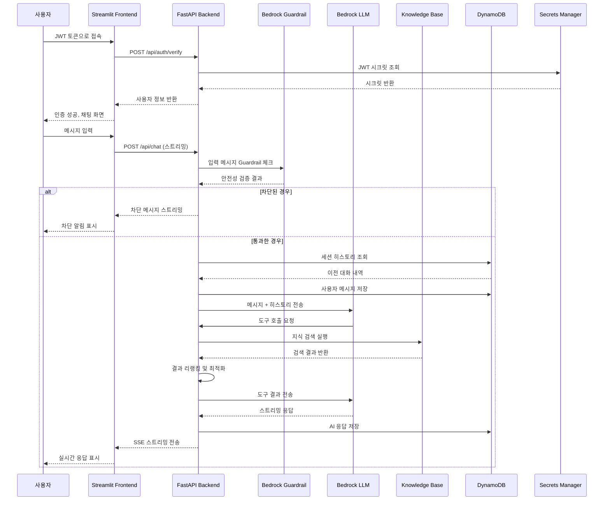

# 채팅 데이터플로우 상세 프로세스

## 🔄 전체 채팅 플로우 다이어그램



## 📊 단계별 상세 프로세스

### 1️⃣ **인증 단계** (app.py → auth.py)

```python
# 1. 토큰 추출
query_params = st.query_params
token = query_params.get("token", None)

# 2. 토큰 검증
def verify_token(token: str) -> bool:
    response = requests.post(f"{FASTAPI_URL}/api/auth/verify", json={"token": token})
    # JWT 디코딩 및 사용자 정보 추출

# 3. 세션 상태 설정
st.session_state["user_id"] = user_info["user_id"]
st.session_state["last_active"] = datetime.now(timezone.utc)
```

### 2️⃣ **채팅 요청 단계** (chat.py → request.py → main.py)

```python
# Frontend: 사용자 입력 처리
if user_question := st.chat_input():
    user_message_id = st.session_state.message_counter
    st.session_state.message_counter += 1
    st.session_state.message_list.append({
        "role": "user", 
        "content": user_question, 
        "id": user_message_id
    })

# API 호출
response_chunks = call_fastapi_predict(
    user_question,
    session_id,
    model_id,
    user_message_id,
    ai_response_message_id,
    user_prompt
)
```

### 3️⃣ **보안 검증 단계** (main.py → Guardrail)

```python
# Guardrail 입력 검증
async def check_input_guardrail(user_message_content: str):
    bedrock_client = bedrock_clients['ap-northeast-2']
    response = await bedrock_client.apply_guardrail(
        guardrailIdentifier=config.guardrail_id,
        guardrailVersion=config.guardrail_version,
        source='INPUT',
        content=[{'text': {'text': user_message_content}}]
    )
    return response

# 차단 시 처리
if guardrail_response["action"] == "GUARDRAIL_INTERVENED":
    return await create_guardrail_blocked_response(guardrail_response)
```

### 4️⃣ **히스토리 관리 단계** (chat_controller.py → history_service.py)

```python
# 히스토리 로드
history_service = HistoryService(session_id=session_id, user_ip=user_ip)
loaded_messages: List[BaseMessage] = await history_service.get_messages()

# 사용자 메시지 저장
await history_service.add_user_message(user_message_content, user_message_id)

# tool_calls 제거 (히스토리 재사용 시 에러 방지)
cleaned_messages = []
for msg in messages:
    if isinstance(msg, AIMessage):
        # content에서 toolUse 블록 제거
        cleaned_content = [
            block for block in msg.content 
            if not (isinstance(block, dict) and block.get('type') in ['tool_use', 'toolUse'])
        ]
```

### 5️⃣ **LLM 처리 단계** (chat_service.py)

```python
# 메시지 구성
def build_messages(self, loaded_history, user_message_content, group):
    return [
        self._build_system_prompt(),  # 시스템 프롬프트
        *loaded_history,              # 이전 대화
        HumanMessage(content=user_message_content.strip())  # 현재 입력
    ]

# 스트리밍 응답 생성
async def generate_streaming_response(self, messages, ai_response_message_id, group):
    while True:  # 도구 호출 루프
        # LLM 스트리밍 호출
        async for chunk in self.llm.astream(messages + current_messages):
            if chunk.content:
                yield f"data: {json.dumps({'role': 'assistant', 'content': content})}\n\n"
        
        # 도구 호출 처리
        if ai_message.tool_calls:
            for tool_call in ai_message.tool_calls:
                tool_result = self.tool_dict[tool_name](**tool_args)
                yield f"data: {json.dumps({'role': 'tool', 'content': tool_result})}\n\n"
        else:
            break  # 도구 호출 없으면 종료
```

### 6️⃣ **지식 검색 단계** (retrieve_knowledge_search.py)

```python
# 1. Knowledge Base 검색
def retrieve_knowledge_base_search(query: str, group: str):
    response = bedrock_agent_runtime_client.retrieve(
        knowledgeBaseId=knowledge_id,
        retrievalConfiguration={
            "vectorSearchConfiguration": {
                "numberOfResults": 5,
                "overrideSearchType": "HYBRID"
            }
        },
        retrievalQuery={"text": query}
    )
    
    # 2. 결과 리랭킹 (Cohere)
    reranked = rerank_results(query, results, top_k=5)
    
    # 3. 동적 길이 최적화
    optimized = apply_dynamic_truncation(reranked)
    
    return optimized
```

### 7️⃣ **응답 스트리밍 단계** (chat_controller.py → Frontend)

```python
# Backend: SSE 스트리밍
async def stream_generator():
    async for item in chat_service.generate_streaming_response():
        if isinstance(item, BaseMessage):
            await history_service.add_message(item, item_message_id)
        elif isinstance(item, str):
            yield item  # SSE 데이터 전송

# Frontend: 실시간 수신
for chunk in response_chunks:
    if isinstance(chunk, dict) and chunk.get("role") == "assistant":
        full_response += chunk["content"]
        placeholder.write(full_response)  # 실시간 업데이트
```

## 🔍 데이터 구조 상세

### **메시지 구조**
```python
# 사용자 메시지
{
    "role": "user",
    "content": "질문 내용",
    "id": 123,
    "timestamp": "2024-11-24T10:00:00Z"
}

# AI 응답
{
    "role": "assistant", 
    "content": "답변 내용",
    "id": 124,
    "tool_calls": [...],  # 도구 호출 정보
    "source_data": [...]  # 검색 결과
}
```

### **도구 호출 구조**
```python
{
    "name": "retrieve_knowledge_base_search",
    "args": {"query": "사용자 질문", "group": "common"},
    "id": "call_abc123"
}
```

### **검색 결과 구조**
```python
{
    "content": {"text": "문서 내용"},
    "metadata": {"x-amz-bedrock-kb-document-page-number": 1},
    "location": {"s3Location": {"uri": "s3://bucket/file.pdf"}},
    "score": 0.85
}
```

## ⚡ 성능 최적화 포인트

1. **토큰 절약**: 동적 문서 길이 조정
2. **응답 속도**: 스트리밍 + 비동기 처리
3. **메모리 효율**: tool_calls 제거, 히스토리 정리
4. **검색 정확도**: 하이브리드 검색 + 리랭킹