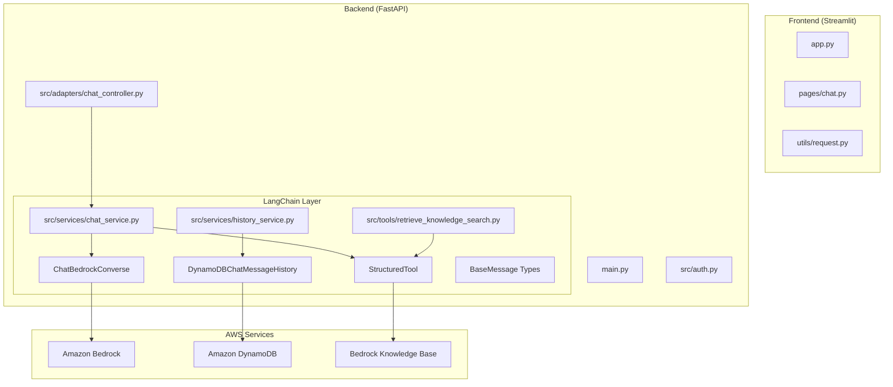

# LangChain 통합 아키텍처 상세

## 🔍 현재 LangChain 사용 현황

### **LangChain이 숨겨진 위치들**



## 📊 LangChain 컴포넌트 상세 매핑

### **1. LLM 통합 (ChatBedrockConverse)**
```python
# src/services/chat_service.py
from langchain_aws import ChatBedrockConverse

class ChatService:
    def __init__(self, model: str, temperature: float, max_tokens: int):
        # LangChain의 Bedrock 통합
        self.llm = ChatBedrockConverse(
            model=model,
            temperature=temperature,
            max_tokens=max_tokens,
            region_name=region_name,
        ).bind_tools(tools)  # 도구 바인딩
```

### **2. 메시지 히스토리 (DynamoDBChatMessageHistory)**
```python
# src/services/history_service.py
from langchain_community.chat_message_histories import DynamoDBChatMessageHistory
from langchain_core.messages import BaseMessage, HumanMessage, AIMessage

class HistoryService:
    def __init__(self, session_id: str, user_ip: str):
        # LangChain의 DynamoDB 히스토리 통합
        self.history = DynamoDBChatMessageHistory(
            table_name=table_name,
            session_id=session_id,
            key=dynamodb_key,
            boto3_session=boto3_session
        )
    
    async def get_messages(self) -> List[BaseMessage]:
        # LangChain BaseMessage 타입 반환
        return self.history.messages
```

### **3. 도구 통합 (StructuredTool)**
```python
# src/tools/retrieve_knowledge_search.py
from langchain_core.tools import StructuredTool
from pydantic import BaseModel, Field

class KnowledgeSearchInput(BaseModel):
    query: str = Field(title="쿼리", description="검색할 쿼리 문자열")
    group: str = Field(default="common", title="그룹")

# LangChain 도구로 래핑
tool = StructuredTool.from_function(
    func=retrieve_knowledge_base_search,
    name="retrieve_knowledge_base_search",
    description=retrieve_knowledge_base_search.__doc__,
    args_schema=KnowledgeSearchInput,
    return_direct=False,
)
```

### **4. 메시지 타입 (BaseMessage)**
```python
# src/services/chat_service.py
from langchain_core.messages import BaseMessage, SystemMessage, HumanMessage, AIMessage, ToolMessage

def build_messages(self, loaded_history, user_message_content, group):
    return [
        SystemMessage(content=self.system_prompt),  # LangChain 메시지 타입
        *loaded_history,                            # List[BaseMessage]
        HumanMessage(content=user_message_content)  # LangChain 메시지 타입
    ]
```

## 🔄 LangChain 데이터 플로우

### **메시지 처리 플로우**
```python
# 1. 사용자 입력 → LangChain HumanMessage
user_input = "안녕하세요"
human_msg = HumanMessage(content=user_input)

# 2. 히스토리 로드 → List[BaseMessage]
history: List[BaseMessage] = await history_service.get_messages()

# 3. 메시지 구성 → LangChain 메시지 체인
messages = [
    SystemMessage(content=system_prompt),
    *history,
    human_msg
]

# 4. LLM 호출 → ChatBedrockConverse
response: AIMessage = await self.llm.ainvoke(messages)

# 5. 도구 호출 → StructuredTool
if response.tool_calls:
    for tool_call in response.tool_calls:
        tool_result = self.tool_dict[tool_name](**tool_args)
        tool_msg = ToolMessage(content=tool_result, tool_call_id=tool_call_id)

# 6. 히스토리 저장 → DynamoDBChatMessageHistory
history_service.add_message(response)
```

## 🏗️ LangChain 아키텍처 레이어

### **Layer 1: LangChain Core**
```python
# 메시지 추상화
BaseMessage, HumanMessage, AIMessage, SystemMessage, ToolMessage

# 도구 추상화  
StructuredTool, BaseTool

# 프롬프트 추상화
PromptTemplate, ChatPromptTemplate
```

### **Layer 2: LangChain Integrations**
```python
# AWS 통합
ChatBedrockConverse (langchain-aws)
DynamoDBChatMessageHistory (langchain-community)

# 도구 통합
StructuredTool.from_function()
```

### **Layer 3: Application Logic**
```python
# 비즈니스 로직
ChatService, HistoryService

# 도구 구현
retrieve_knowledge_base_search()
```

## 🔧 LangChain 설정 및 최적화

### **1. 모델 설정**
```python
# 모델별 리전 매핑
MODEL_REGION_MAP = {
    "openai.gpt-oss-120b-1:0": "us-west-2",
    "us.anthropic.claude-3-5-haiku-20241022-v1:0": "us-east-1",
}

# LangChain 모델 초기화
self.llm = ChatBedrockConverse(
    model=model,
    temperature=temperature,
    max_tokens=max_tokens,
    region_name=MODEL_REGION_MAP.get(model, DEFAULT_REGION),
).bind_tools(tools)
```

### **2. 히스토리 최적화**
```python
# tool_calls 제거 (토큰 절약)
cleaned_messages = []
for msg in messages:
    if isinstance(msg, AIMessage):
        # content에서 toolUse 블록 제거
        cleaned_content = [
            block for block in msg.content 
            if not (isinstance(block, dict) and block.get('type') in ['tool_use', 'toolUse'])
        ]
        cleaned_msg = AIMessage(content=cleaned_content)
        cleaned_messages.append(cleaned_msg)
```

### **3. 스트리밍 최적화**
```python
# LangChain 스트리밍
async for chunk in self.llm.astream(messages):
    if ai_message == None:
        ai_message = chunk
    else:
        ai_message = ai_message + chunk  # LangChain 메시지 병합
    
    # 컨텐츠 추출 및 전송
    if chunk.content:
        yield f"data: {json.dumps({'role': 'assistant', 'content': content})}\n\n"
```

## 📈 LangChain 사용의 장점

### **1. 추상화 레이어**
- AWS Bedrock API 복잡성 숨김
- 일관된 메시지 인터페이스 제공
- 다양한 LLM 모델 간 호환성

### **2. 통합 생태계**
- DynamoDB 히스토리 자동 관리
- 도구 호출 표준화
- 프롬프트 템플릿 관리

### **3. 개발 효율성**
- 보일러플레이트 코드 감소
- 타입 안전성 제공
- 디버깅 및 로깅 지원

## 🎯 향후 LangChain 활용 계획

### **1. LangGraph 도입**
```python
# 복잡한 워크플로우 관리
from langgraph import StateGraph

workflow = StateGraph()
workflow.add_node("search", knowledge_search_node)
workflow.add_node("generate", llm_generate_node)
workflow.add_edge("search", "generate")
```

### **2. LangSmith 통합**
```python
# 모니터링 및 디버깅
from langsmith import trace

@trace
async def generate_response(self, messages):
    return await self.llm.ainvoke(messages)
```

### **3. 캐싱 최적화**
```python
# LangChain 캐싱
from langchain.cache import InMemoryCache
from langchain.globals import set_llm_cache

set_llm_cache(InMemoryCache())
```

## 📋 LangChain 의존성 현황

```python
# pyproject.toml
dependencies = [
    "langchain>=0.3.17",           # 핵심 프레임워크
    "langchain-aws>=0.2.12",       # AWS 통합
    "langchain-community>=0.3.21", # 커뮤니티 통합
]
```

LangChain은 현재 시스템의 **핵심 오케스트레이션 레이어**로 작동하고 있으며, AWS Bedrock과 애플리케이션 로직 사이의 중요한 추상화 역할을 담당하고 있습니다!