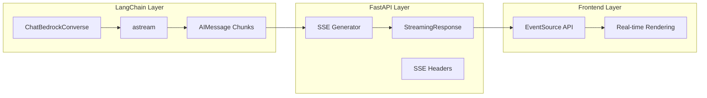

# 스트리밍 아키텍처 정정

## 🔄 실제 스트리밍 처리 구조

### **레이어별 역할 분담**



## 📊 정확한 스트리밍 플로우

### **1. LangChain 역할 (LLM 응답 생성)**
```python
# src/services/chat_service.py
from langchain_aws import ChatBedrockConverse

class ChatService:
    async def generate_streaming_response(self, messages):
        # LangChain: Bedrock LLM 스트리밍 호출
        async for chunk in self.llm.astream(messages):
            if chunk.content:
                # LangChain: 청크 데이터 추출
                content = self._extract_content(chunk)
                # 여기서 LangChain 역할 끝, FastAPI로 전달
                yield content
```

### **2. FastAPI 역할 (SSE 포맷 변환 및 전송)**
```python
# src/adapters/chat_controller.py
from fastapi.responses import StreamingResponse

async def handle_chat_request():
    async def stream_generator():
        async for content in chat_service.generate_streaming_response(messages):
            # FastAPI: SSE 포맷으로 변환
            sse_data = f"data: {json.dumps({'role': 'assistant', 'content': content})}\n\n"
            yield sse_data  # FastAPI SSE 전송
        
        # FastAPI: 스트림 종료 시그널
        yield "data: [DONE]\n\n"
    
    # FastAPI: StreamingResponse로 래핑
    return StreamingResponse(
        stream_generator(),
        media_type="text/event-stream",
        headers={
            "Cache-Control": "no-cache",
            "Connection": "keep-alive",
            "X-Accel-Buffering": "no"
        }
    )
```

### **3. Frontend 역할 (SSE 수신 및 렌더링)**
```python
# utils/request.py
def call_fastapi_predict():
    response = requests.post(endpoint, json=payload, stream=True)
    
    for line in response.iter_lines():
        if line and line.startswith(b'data:'):
            # Frontend: SSE 데이터 파싱
            json_str = line.decode('utf-8')[5:].strip()
            if json_str == '[DONE]':
                break
            
            # Frontend: JSON 파싱 및 UI 업데이트
            data = json.loads(json_str)
            yield data
```

## 🔧 각 레이어의 구체적 책임

### **LangChain 책임**
- ✅ AWS Bedrock API 추상화
- ✅ 메시지 타입 관리 (BaseMessage, AIMessage)
- ✅ 도구 호출 처리 (StructuredTool)
- ✅ LLM 스트리밍 응답 생성 (`astream()`)
- ❌ SSE 포맷 변환 (FastAPI 담당)
- ❌ HTTP 헤더 관리 (FastAPI 담당)

### **FastAPI 책임**
- ✅ SSE 포맷 변환 (`data: {...}\n\n`)
- ✅ HTTP 스트리밍 응답 (`StreamingResponse`)
- ✅ SSE 헤더 설정 (`text/event-stream`)
- ✅ 연결 관리 (`keep-alive`, `no-cache`)
- ❌ LLM 호출 (LangChain 담당)
- ❌ 메시지 히스토리 (LangChain 담당)

### **Frontend 책임**
- ✅ SSE 연결 관리 (`requests.post(stream=True)`)
- ✅ 실시간 데이터 파싱
- ✅ UI 실시간 업데이트
- ❌ LLM 처리 (Backend 담당)
- ❌ SSE 포맷 생성 (Backend 담당)

## 🔄 데이터 변환 과정

### **1단계: LangChain → Python Object**
```python
# LangChain AIMessage Chunk
chunk = AIMessage(
    content=[{"type": "text", "text": "안녕하세요"}],
    response_metadata={"stopReason": "end_turn"}
)

# Python String 추출
content = "안녕하세요"
```

### **2단계: Python Object → SSE Format**
```python
# FastAPI SSE 변환
sse_data = f"data: {json.dumps({'role': 'assistant', 'content': '안녕하세요'})}\n\n"
# 결과: "data: {\"role\": \"assistant\", \"content\": \"안녕하세요\"}\n\n"
```

### **3단계: SSE Format → Frontend JSON**
```python
# Frontend 파싱
line = b'data: {"role": "assistant", "content": "안녕하세요"}\n\n'
json_str = line.decode('utf-8')[5:].strip()  # "data: " 제거
data = json.loads(json_str)  # {"role": "assistant", "content": "안녕하세요"}
```

## 🎯 정정된 아키텍처 다이어그램

```mermaid
graph TB
    subgraph "Frontend (Streamlit)"
        App[app.py]
        Utils[utils/request.py - SSE Client]
    end
    
    subgraph "Backend (FastAPI)"
        Controller[chat_controller.py - SSE Server]
        
        subgraph "LangChain Layer"
            ChatService[chat_service.py]
            BedrockLLM[ChatBedrockConverse astream]
        end
        
        subgraph "FastAPI SSE Layer"
            StreamGen[stream_generator()]
            SSEResponse[StreamingResponse]
        end
    end
    
    subgraph "AWS Services"
        Bedrock[Amazon Bedrock]
    end
    
    Utils --> |HTTP POST stream=True| Controller
    Controller --> ChatService
    ChatService --> BedrockLLM
    BedrockLLM --> |AIMessage chunks| StreamGen
    StreamGen --> |SSE format| SSEResponse
    SSEResponse --> |text/event-stream| Utils
    BedrockLLM --> Bedrock
```

## 📋 요약

**스트리밍 처리에서:**
- **LangChain**: LLM 응답 생성 및 청크 스트리밍
- **FastAPI**: SSE 포맷 변환 및 HTTP 스트리밍 전송
- **Frontend**: SSE 수신 및 실시간 UI 업데이트

각각 명확히 분리된 책임을 가지고 있습니다!